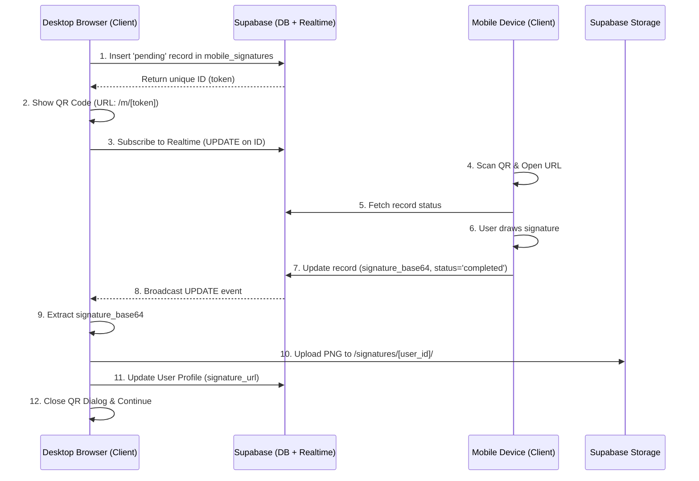

# Mobile Signature QR Flow: Technical Documentation

This document details the implementation of the "Sign with Mobile" feature, which allows users to capture high-quality digital signatures using their smartphone's touchscreen while working on a desktop PC.

## Overview

Drawing a fluid signature with a mouse is difficult. This feature bridges the gap by:
1. Generating a unique session on the Desktop.
2. Displaying a QR code that points the mobile device to a dedicated signing page.
3. Using **Supabase Realtime** to instantly sync the captured signature back to the Desktop.

## Architecture



## 1. Database Schema

The implementation relies on the `mobile_signatures` table.

```sql
CREATE TABLE public.mobile_signatures (
    id uuid PRIMARY KEY DEFAULT gen_random_uuid(),
    user_id uuid REFERENCES public.profiles(id) ON DELETE CASCADE,
    signature_base64 text,
    status text DEFAULT 'pending' CHECK (status IN ('pending', 'completed')),
    created_at timestamptz DEFAULT now(),
    expires_at timestamptz DEFAULT now() + interval '15 minutes'
);
```

### Row Level Security (RLS)
Crucial for security, as the mobile device is usually unauthenticated (anonymous).

- **Insert**: Only the logged-in Desktop user can create the request.
- **Select**: Anyone (including anonymous mobile users) can view a record if they have the ID.
- **Update**: Anyone can update a **pending and non-expired** record, but only to set it to `completed`.

```sql
-- Migration snippet (022_fix_mobile_signatures_update.sql)
CREATE POLICY "Anyone can complete a pending signature" ON public.mobile_signatures 
  FOR UPDATE TO anon, authenticated 
  USING (status = 'pending' AND expires_at > now())
  WITH CHECK (status = 'completed');
```

## 2. Desktop Implementation (PC)

Located in `components/settings/signature-pad.tsx` and `app/(auth)/onboarding/signature/page.tsx`.

### Key Steps:
1. **Request**: `requestMobileSign()` inserts a record into Supabase.
2. **Listen**: `useEffect` sets up a Realtime channel filtered to the specific `id`.
3. **QR Display**: Uses `react-qr-code` to show the URL `${window.location.origin}/m/${mobileToken}`.
4. **Completion**: When the Realtime event fires with `status: 'completed'`, the Desktop UI hides the QR code and processes the `signature_base64`.

```typescript
const channel = supabase.channel(`mobile_sign_${mobileToken}`)
    .on('postgres_changes', { 
        event: 'UPDATE', 
        schema: 'public', 
        table: 'mobile_signatures', 
        filter: `id=eq.${mobileToken}` 
    }, async (payload) => {
        if (payload.new.status === 'completed' && payload.new.signature_base64) {
            handleMobileCaptured(payload.new.signature_base64);
        }
    })
    .subscribe();
```

## 3. Mobile Implementation

Located in `app/m/[token]/page.tsx`.

### Key Steps:
1. **Dynamic Route**: Uses `[token]` to identify the specific signature request.
2. **Signature Canvas**: Uses `react-signature-canvas` for the drawing interface.
3. **Viewport Logic**: Custom CSS/JS to handle mobile browser address bars (`--vh` trick) ensuring the canvas fills the screen correctly.
4. **Submission**: Updates the Supabase record with the base64 image data.

```typescript
const handleSave = async () => {
    const dataURL = sigCanvas.current?.getTrimmedCanvas().toDataURL('image/png');
    await supabase.from('mobile_signatures')
        .update({ signature_base64: dataURL, status: 'completed' })
        .eq('id', token);
};
```

## 4. Key Lessons for Re-Implementation

### Realtime Subscription
Ensure the table is added to the `supabase_realtime` publication:
```sql
ALTER PUBLICATION supabase_realtime ADD TABLE public.mobile_signatures;
```

### Base64 to Blob
Browsers may block `fetch(dataURL)` due to CSP. Use a manual conversion helper to turn the base64 string into a `Blob` before uploading to Supabase Storage.

### Cache Busting
When updating an existing signature file in storage, append a timestamp to the public URL to force the browser to refresh the image:
```typescript
const cacheBustedUrl = `${data.publicUrl}?t=${new Date().getTime()}`;
```

### Mobile UX
Use `touch-none` on the canvas container to prevent the mobile page from scrolling or zooming while the user is drawing.
