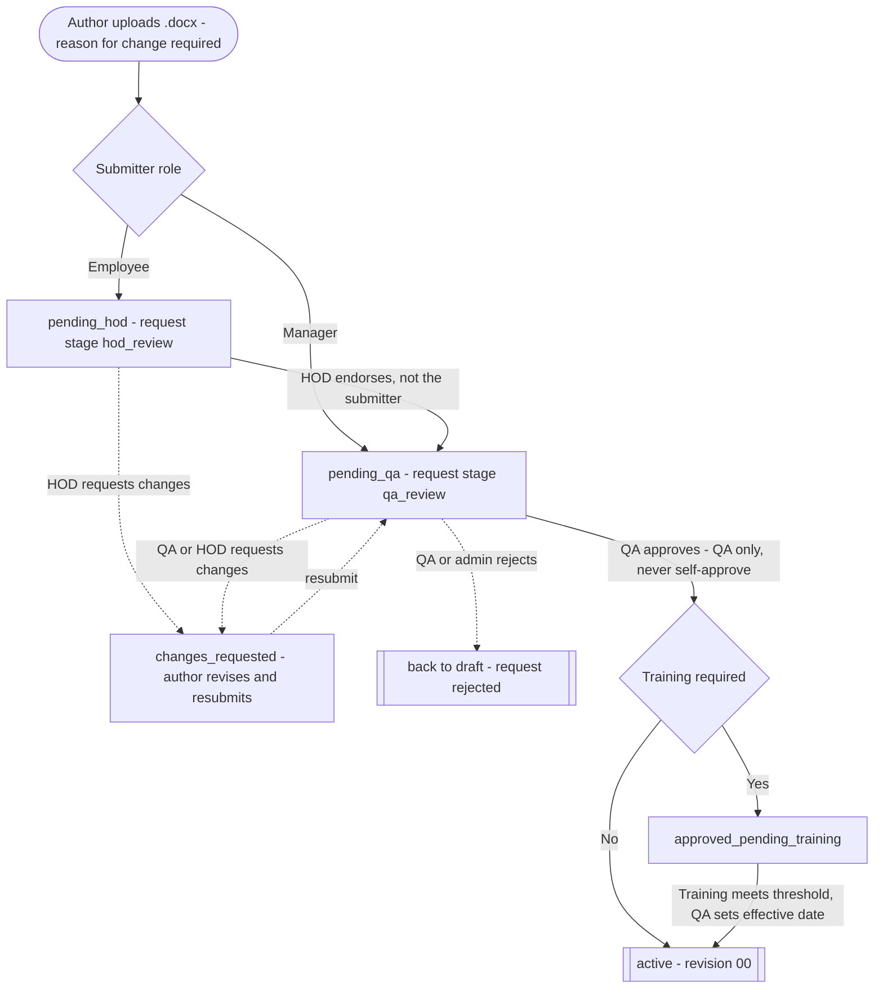
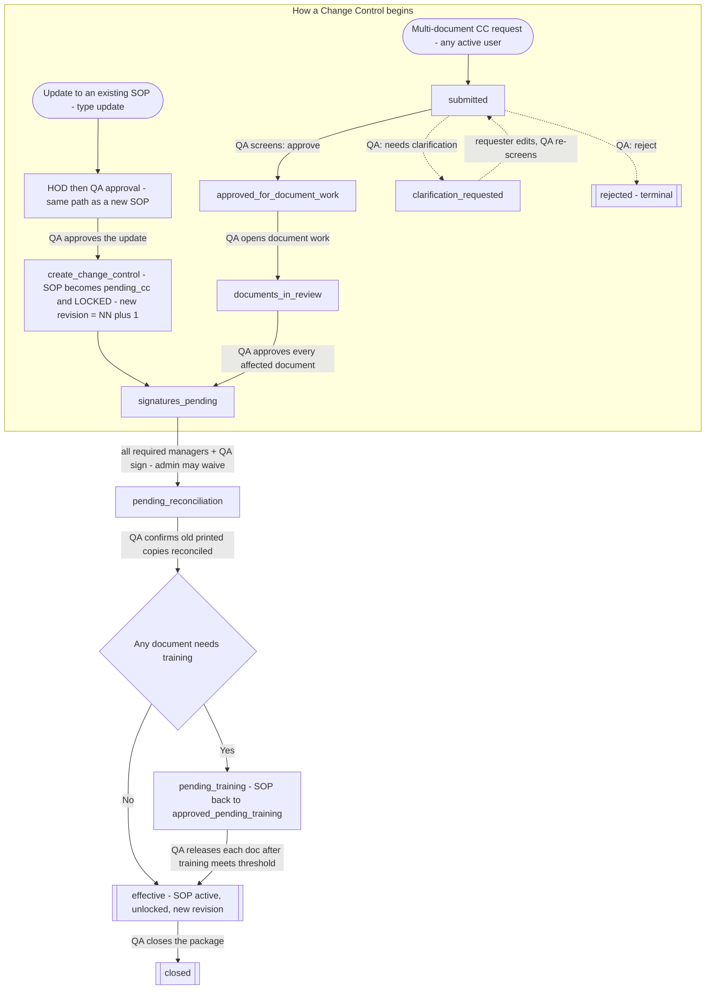

# Document Control Flow — as implemented in the app

> Traced from the real code (`actions/sop.ts`, `actions/change-control.ts`, and the Postgres RPCs/triggers in `supabase/migrations/`, final effective behavior). The diagrams are Mermaid — they render in GitHub, VS Code (with a Mermaid extension), or https://mermaid.live.

---

## 1. New SOP — creation → active

---

## 2. Revision → Change Control (two entry points, one shared tail)

---

## Who can do what (the gates)

- **QA is the sole approval authority** and **cannot self-approve** (submitter ≠ approver).
- **HOD endorsement is mandatory** for employee submissions before QA sees it.
- A revision **always** routes through Change Control — there is no "minor edit skips CC" shortcut.
- While a CC is open, the SOP is **locked** (`pending_cc`) — no new updates accepted until it goes effective.
- **Revisions are two-digit GMP numbers** (`00 → 01 → 02 …`), not `v1.0` / major.minor.

---

## ⚠️ Two gaps to check against your findings

1. **`superseded → pending_destruction → destroyed` is unreachable.** A revision updates the same SOP row in place; nothing in the code ever sets `superseded`, so the document destruction / retirement lifecycle is orphaned. Version history is kept in `sop_versions`, but the SOP record itself never enters a retired/superseded state.
2. **Two CC statuses are defined but never produced:** `draft` and `qa_screening`. Requests are inserted straight at `submitted`, so those are dead states in the enum.

---

## Full state reference

### `sops.status`
`draft → draft_in_review → pending_hod → pending_qa → approved_pending_training → pending_cc → active → superseded → pending_destruction → destroyed`
(last three currently unreachable — see gap 1)

### `sop_approval_requests`
- `status`: pending · changes_requested · approved · rejected
- `approval_stage`: hod_review · qa_review

### `change_controls.status` (CC package)
`draft* → submitted → qa_screening* → clarification_requested → approved_for_document_work → documents_in_review → signatures_pending → pending_reconciliation → pending_training → effective → closed` (+ `rejected`)
(`*` = defined but never produced — see gap 2)

### Transition index (FROM → TO: trigger by actor)

**SOP document**
- ∅ → pending_hod: submitSopForApproval — employee
- ∅ → pending_qa: submitSopForApproval — manager
- pending_hod → pending_qa: endorseSopToQa — dept HOD (≠ submitter)
- pending_qa → active: approve_sop_request (new, no training) — QA
- pending_qa → approved_pending_training: approve_sop_request (new, training) — QA
- approved_pending_training → active: setSopEffectiveDate / activate_sop_effective — QA
- pending_hod | pending_qa → draft: rejectSopRequest (type=new) — QA/admin
- active → pending_cc (+locked): create_change_control (on QA approval of an update) — QA
- pending_cc → active | approved_pending_training (+unlock): confirm_cc_reconciliation — QA/admin

**Approval request**
- pending (hod_review) → pending (qa_review): endorseSopToQa — HOD
- pending → approved: approve_sop_request — QA
- pending → changes_requested: requestChangesSop — QA or HOD
- pending → rejected: rejectSopRequest — QA/admin

**CC package**
- submitted → approved_for_document_work | clarification_requested | rejected: screenChangeControlRequest — QA
- approved_for_document_work → documents_in_review: updateChangeControlStatus — QA
- approved_for_document_work | documents_in_review → signatures_pending: set_cc_document_review auto (all docs approved) — QA
- [origin sop_revision] ∅ → signatures_pending directly: create_change_control — QA approval
- signatures_pending → pending_reconciliation: signature_inserted trigger → check_cc_completion (all signed/waived) — signatories / admin
- pending_reconciliation → effective (no training) | pending_training (any training): confirm_cc_reconciliation — QA/admin
- pending_training → effective: releaseChangeControlDocumentTraining → cc_recheck_effective — QA/admin
- any → closed: updateChangeControlStatus — QA/admin

---

*Key files: `actions/sop.ts`, `actions/change-control.ts`, `supabase/migrations/046_*` (approve_sop_request), `052_*` (create_change_control, check_cc_completion), `053_*` (set_cc_document_review, confirm_cc_reconciliation, cc_snapshot_signatories), `054_*` (cc_recheck_effective), `055_*` (status CHECK), `010_triggers.sql` (signature trigger), `045_*` (activate_sop_effective).*
